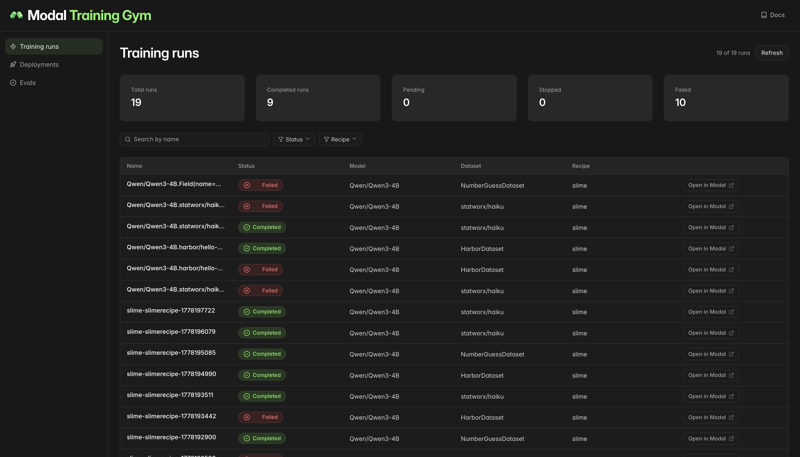

# Training Gym

**[📖 Documentation](https://gym.modal.dev)** · **[Tutorials](https://gym.modal.dev/tutorials/)** · **[API Reference](https://gym.modal.dev/reference/)**

Modal Training Gym is a Python SDK for **RL post-training** on [Modal](https://modal.com) — so you don't have to hand-roll a launcher every time.
Pick a base model, a dataset, and an RL framework (GRPO, PPO, custom reward / generate functions); the gym handles cluster topology, Ray/NCCL bring-up, volume mounts, checkpointing, and serving for eval and rollouts. SFT and plain distributed training are supported too — but RL is the happy path.

## Quickstart

Install with pip:

```bash
pip install -q git+https://github.com/modal-projects/training-gym.git@main
```

Or pin it in `pyproject.toml` for uv:

```toml
training-gym = { git = "https://github.com/modal-projects/training-gym.git", branch = "main" }
```

Then import the building blocks from your own script:

```python
from modal_training_gym import TrainConfig
```

## Agent set-up

This repository includes an `AGENTS.md` and a `skills/` directory (symlinked to `.claude/skills/`) that teach Claude Code how to navigate the framework — W&B configuration, custom rollouts and generate functions, custom eval functions, and more.

Clone the repo and run `claude` from its root; the skills load automatically based on what you ask for.

## Observability dashboard

Training Gym ships a dashboard that aggregates training runs, deployments,
and eval results in one place. Deploy your own copy:

```bash
training-gym setup
```

Modal prints a URL where you can watch jobs in progress.




## Tutorials

The fastest path through the API is the [tutorials](./tutorials/). Each one
ships as a runnable `.py` **and** a paired `.ipynb` narrated cell-by-cell —
the notebook is the canonical walkthrough. Each tutorial below has a one-click
**Launch** button that opens the `.ipynb` in a fresh Modal Notebook; the first
code cell pip-installs `modal-training-gym` into the notebook kernel, so the
rest of the cells run as-is.

**Difficulty** is a rough self-assessed signal for where to start:

- *Beginner* — single-node, introduces one framework concept.
- *Intermediate* — 1–2 nodes, or wires up something non-default (custom
  reward, external script).
- *Advanced* — ≥2 nodes with non-trivial parallelism (tensor-parallel,
  colocated RL, long context); assumes familiarity with the underlying
  framework.

<!-- BEGIN TUTORIAL TABLE -->
<!-- Auto-generated by generate_tutorial.py from TUTORIAL_METADATA in each tutorial source. Edit metadata there, not here. -->

### RL

| Tutorial | Summary | Difficulty | Framework | Launch |
|---|---|---|---|---|
| [`000_rl_basics`](tutorials/rl/000_rl_basics/000_rl_basics.ipynb) | Qwen3-4B haiku evaluation with verifiable rewards — serve, evaluate, train, compare | Beginner | `slime` | <a href="https://modal.com/notebooks/new/https://github.com/modal-projects/training-gym/blob/main/tutorials/rl/000_rl_basics/000_rl_basics.ipynb" target="_blank" rel="nofollow noopener noreferrer"></a> |
| [`001_sandboxes`](tutorials/rl/001_sandboxes/001_sandboxes.ipynb) | Code RL with Harbor hello-world and sandboxed verification | Intermediate | `slime` | <a href="https://modal.com/notebooks/new/https://github.com/modal-projects/training-gym/blob/main/tutorials/rl/001_sandboxes/001_sandboxes.ipynb" target="_blank" rel="nofollow noopener noreferrer"></a> |
| [`002_multiturn`](tutorials/rl/002_multiturn/002_multiturn.ipynb) | Multi-turn number-guessing RL with custom generate and reward functions | Intermediate | `slime` | <a href="https://modal.com/notebooks/new/https://github.com/modal-projects/training-gym/blob/main/tutorials/rl/002_multiturn/002_multiturn.ipynb" target="_blank" rel="nofollow noopener noreferrer"></a> |
| [`003_on_policy_distillation`](tutorials/rl/003_on_policy_distillation/003_on_policy_distillation.ipynb) | On-policy distillation on math — Qwen3-8B teacher, Qwen3-4B student | Intermediate | `slime` | <a href="https://modal.com/notebooks/new/https://github.com/modal-projects/training-gym/blob/main/tutorials/rl/003_on_policy_distillation/003_on_policy_distillation.ipynb" target="_blank" rel="nofollow noopener noreferrer"></a> |
<!-- END TUTORIAL TABLE -->

See [`tutorials/README.md`](tutorials/README.md) for how to run the `.py`
companions from the CLI and how to author a new tutorial.

## Multi-node access

> [!IMPORTANT]
> Single-node training is open to everyone. Multi-node clusters — required
> for larger models — are still in Beta.
> [**Contact us on Slack**](https://modal.com/slack) for access.

## Architecture


## Documentation

Full docs are hosted at **[gym.modal.dev](https://gym.modal.dev)**:

- [Tutorials](https://gym.modal.dev/tutorials/) — step-by-step runnable examples
- [API Reference](https://gym.modal.dev/reference/) — every public class documented with types and defaults

Modal platform references:

- [Using CUDA on Modal](https://modal.com/docs/guide/cuda)
- [GPU Metrics](https://modal.com/docs/guide/gpu-metrics)
- [Multi-node clusters (Beta)](https://modal.com/docs/guide/multi-node-training)
- [Multi-GPU training on Modal](https://modal.com/docs/guide/gpu#multi-gpu-training)

## License

[MIT](LICENSE).

---

# Contributing Guide

## Layout

```
modal_training_gym/        ← installable package
├── common/                ← shared classes (datasets, models, eval, deployment, Ray helpers)
├── deploy_recipes/        ← serving presets for engines like SGLang and vLLM
├── frameworks/            ← launcher implementations that build Modal apps
└── train_recipes/         ← training presets such as SlimeRecipe

tutorials/                 ← runnable examples — one folder per tutorial
├── tutorial_generator/    ← source files; each produces a .py + .ipynb
└── generate_tutorial.py   ← AST-walks the sources, regenerates .py + .ipynb

dashboards/                ← observability dashboard (deploy with `modal deploy dashboards/app.py`)
docs-next/                 ← Starlight docs site (deploy with `modal deploy docs-next/docs_next_app.py`)
.claude/skills/            ← agent skills for navigating this repo
```

## Dev setup

```bash
# editable install + pinned dev deps (pre-commit, etc.)
uv sync

# optional: register this venv as a Jupyter kernel for notebook work
uv run python -m ipykernel install --user --name=modal-training-gym

# install the pre-commit hook locally
uv run pre-commit install
```

Python is pinned to 3.12 (see `.python-version` and `pyproject.toml`). Modal's
`@app.function(serialized=True)` requires the local and remote Python versions
to match, and the framework images we ship (slime nightly, NeMo 25.11) are all
py312.

## Authoring a new tutorial

See [`tutorials/README.md`](tutorials/README.md#authoring-a-new-tutorial)
for the generator-source format and the per-tutorial `TUTORIAL_METADATA`
schema.

## Contributing a new recipe

1. Add a train recipe under `modal_training_gym/train_recipes/`, or a deploy
   recipe under `modal_training_gym/deploy_recipes/`.
2. If the recipe needs new runtime behavior, wire it into the relevant launcher
   or serving builder under `modal_training_gym/frameworks/` or
   `modal_training_gym/deploy_recipes/*/serve_*.py`.
3. Add or update a source tutorial under
   `tutorials/tutorial_generator/<bucket>/` and run the generator.
4. Keep shared container objects (`dataset`, `model`, `wandb`, `eval`)
   framework-agnostic — recipe layers do the translation into engine-specific
   flags.

## Agent guide

Working on this repo with an AI coding agent? The `.claude/skills/` directory
contains auto-triggering skills for Modal training workflows, example
validation, and repo navigation.
