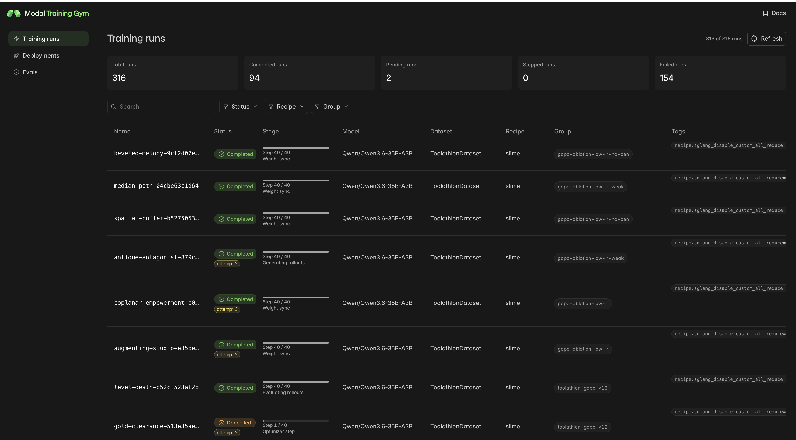

# Training Gym

**[📖 Documentation](https://gym.modal.dev)** · **[API Reference](https://gym.modal.dev/reference/)**

Modal Training Gym is a Python SDK for **RL post-training** on [Modal](https://modal.com)—so you don't have to hand-roll a launcher every time.

Pick a base model, a dataset, and an RL framework; the gym handles cluster topology, Ray/NCCL bring-up, volume mounts, checkpointing, and serving for eval and rollouts.

## Quickstart

Install with pip:

```bash
pip install -q git+https://github.com/modal-projects/training-gym.git@main
```

Or pin it in `pyproject.toml` for uv:

```toml
training-gym = { git = "https://github.com/modal-projects/training-gym.git", branch = "main" }
```

Then import the building blocks from your own script:

```python
from modal_training_gym import TrainConfig
```

> [!NOTE]
> **Python 3.12 is required.** Modal's `serialized=True` functions use
> cloudpickle, which requires the local Python version to exactly match the
> remote container's. All framework images ship Python 3.12, so running from
> 3.11 or 3.13 will fail at app build time.

## Agent set-up

This repository includes an `AGENTS.md` and a `skills/` directory (symlinked to `.claude/skills/`) that teach Claude Code how to navigate the framework — W&B configuration, custom rollouts and generate functions, custom eval functions, and more.

Clone the repo and run `claude` from its root; the skills load automatically based on what you ask for.

## Observability dashboard

Training Gym ships a dashboard that aggregates training runs, deployments,
and eval results in one place. Deploy your own copy:

```bash
training-gym setup
```

Modal prints a URL where you can watch jobs in progress.



### Locking the dashboard down (optional)

The dashboard deploys open. Two opt-in layers, usable together:

- **`training-gym set-password`** puts HTTP Basic in front of the UI and read
  APIs. Browser-friendly; ingestion POSTs keep using their per-run tokens.
- **`TRAINING_GYM_DASHBOARD_REQUIRES_PROXY_AUTH=1`** in the shell running
  `training-gym setup` (or `modal deploy dashboards/app.py`) turns on
  [Modal proxy auth](https://modal.com/docs/guide/webhook-proxy-auth), so
  Modal's edge drops anonymous requests before they reach the app — what
  `DeploymentConfig(unauthenticated=False)` already does for serving
  endpoints. Callers need a workspace `wk-`/`ws-` pair: the CLI and the status
  reporters send it whenever `MODAL_KEY`/`MODAL_SECRET` are set (persist them
  with `training-gym setup`; launchers forward them into training containers),
  and browsers cannot send it at all, which is what the password is for. Read
  at deploy time, so changing it means redeploying. The choice is sticky —
  saved to `~/.training-gym.toml`, so a redeploy without the variable keeps
  it; deploying open again takes an explicit `=0`. Because the pair is a
  workspace-wide credential, clients only send it to `https` Modal-served
  hostnames (`*.modal.run`, `*.modal.direct`); name a custom `https` domain in
  `TRAINING_GYM_PROXY_AUTH_HOSTS` (comma-separated) to allow it.


## Tutorials

The fastest path through the API is the [tutorials](./tutorials/). Each one
ships as a runnable `.py` **and** a paired `.ipynb` narrated cell-by-cell —
the notebook is the canonical walkthrough. Each tutorial below has a one-click
**Launch** button that opens the `.ipynb` in a fresh Modal Notebook; the first
code cell pip-installs `modal-training-gym` into the notebook kernel, so the
rest of the cells run as-is.

**Difficulty** is a rough self-assessed signal for where to start:

- *Beginner* — single-node, introduces one framework concept.
- *Intermediate* — 1–2 nodes, or wires up something non-default (custom
  reward, external script).
- *Advanced* — ≥2 nodes with non-trivial parallelism (tensor-parallel,
  colocated RL, long context); assumes familiarity with the underlying
  framework.

<!-- BEGIN TUTORIAL TABLE -->
<!-- Auto-generated by generate_tutorial.py from TUTORIAL_METADATA in each tutorial source. Edit metadata there, not here. -->

### RL

| Tutorial | Summary | Difficulty | Framework | Launch |
|---|---|---|---|---|
| [`000_rl_basics`](tutorials/rl/000_rl_basics/000_rl_basics.ipynb) | Qwen3-4B haiku evaluation with verifiable rewards — serve, evaluate, train, compare | Beginner | `slime` | <a href="https://modal.com/notebooks/new/https%3A%2F%2Fgithub.com%2Fmodal-projects%2Ftraining-gym%2Fblob%2Fmain%2Ftutorials%2Frl%2F000_rl_basics%2F000_rl_basics.ipynb" target="_blank" rel="nofollow noopener noreferrer"></a> |
| [`001_sandboxes`](tutorials/rl/001_sandboxes/001_sandboxes.ipynb) | Code RL with Harbor hello-world and sandboxed verification | Intermediate | `slime` | <a href="https://modal.com/notebooks/new/https%3A%2F%2Fgithub.com%2Fmodal-projects%2Ftraining-gym%2Fblob%2Fmain%2Ftutorials%2Frl%2F001_sandboxes%2F001_sandboxes.ipynb" target="_blank" rel="nofollow noopener noreferrer"></a> |
| [`002_multiturn`](tutorials/rl/002_multiturn/002_multiturn.ipynb) | Multi-turn number-guessing RL with custom generate and reward functions | Intermediate | `slime` | <a href="https://modal.com/notebooks/new/https%3A%2F%2Fgithub.com%2Fmodal-projects%2Ftraining-gym%2Fblob%2Fmain%2Ftutorials%2Frl%2F002_multiturn%2F002_multiturn.ipynb" target="_blank" rel="nofollow noopener noreferrer"></a> |
| [`003_on_policy_distillation`](tutorials/rl/003_on_policy_distillation/003_on_policy_distillation.ipynb) | On-policy distillation on math — Qwen3-8B teacher, Qwen3-4B student | Intermediate | `slime` | <a href="https://modal.com/notebooks/new/https%3A%2F%2Fgithub.com%2Fmodal-projects%2Ftraining-gym%2Fblob%2Fmain%2Ftutorials%2Frl%2F003_on_policy_distillation%2F003_on_policy_distillation.ipynb" target="_blank" rel="nofollow noopener noreferrer"></a> |
| [`005_dapo`](tutorials/rl/005_dapo/005_dapo.ipynb) | DAPO on math with Qwen3-4B | Advanced | `slime` | <a href="https://modal.com/notebooks/new/https%3A%2F%2Fgithub.com%2Fmodal-projects%2Ftraining-gym%2Fblob%2Fmain%2Ftutorials%2Frl%2F005_dapo%2F005_dapo.ipynb" target="_blank" rel="nofollow noopener noreferrer"></a> |
| [`007_param_sweep`](tutorials/rl/007_param_sweep/007_param_sweep.ipynb) | Sweep hyperparameters across runs with TrainingGroup | Intermediate | `slime` | <a href="https://modal.com/notebooks/new/https%3A%2F%2Fgithub.com%2Fmodal-projects%2Ftraining-gym%2Fblob%2Fmain%2Ftutorials%2Frl%2F007_param_sweep%2F007_param_sweep.ipynb" target="_blank" rel="nofollow noopener noreferrer"></a> |
| [`006_audio_asr`](tutorials/rl/006_audio_asr/006_audio_asr.ipynb) | Audio GRPO on Qwen3-ASR-1.7B — transcribe LibriSpeech, reward −WER | Intermediate | `slime` | <a href="https://modal.com/notebooks/new/https%3A%2F%2Fgithub.com%2Fmodal-projects%2Ftraining-gym%2Fblob%2Fmain%2Ftutorials%2Frl%2F006_audio_asr%2F006_audio_asr.ipynb" target="_blank" rel="nofollow noopener noreferrer"></a> |
| [`008_computer_use`](tutorials/rl/008_computer_use/008_computer_use.ipynb) | GUI grounding with Qwen3-VL-8B — predict click coordinates from screenshots | Advanced | `slime` | <a href="https://modal.com/notebooks/new/https%3A%2F%2Fgithub.com%2Fmodal-projects%2Ftraining-gym%2Fblob%2Fmain%2Ftutorials%2Frl%2F008_computer_use%2F008_computer_use.ipynb" target="_blank" rel="nofollow noopener noreferrer"></a> |
| [`009_cross_tokenizer_distillation`](tutorials/rl/009_cross_tokenizer_distillation/009_cross_tokenizer_distillation.ipynb) | Cross-tokenizer agentic distillation on BFCL v3 multi-turn with live, execution-grounded rewards — DeepSeek V4 Flash teacher, Qwen3.6-35B-A3B student | Advanced | `slime` | <a href="https://modal.com/notebooks/new/https%3A%2F%2Fgithub.com%2Fmodal-projects%2Ftraining-gym%2Fblob%2Fmain%2Ftutorials%2Frl%2F009_cross_tokenizer_distillation%2F009_cross_tokenizer_distillation.ipynb" target="_blank" rel="nofollow noopener noreferrer"></a> |

### Single Node

| Tutorial | Summary | Difficulty | Framework | Launch |
|---|---|---|---|---|
| [`000_qwen35b`](tutorials/singlenode/000_qwen35b/000_qwen35b.ipynb) | Train Qwen3.6-35B-A3B on DAPO-math with GRPO | Advanced | `slime` | <a href="https://modal.com/notebooks/new/https%3A%2F%2Fgithub.com%2Fmodal-projects%2Ftraining-gym%2Fblob%2Fmain%2Ftutorials%2Fsinglenode%2F000_qwen35b%2F000_qwen35b.ipynb" target="_blank" rel="nofollow noopener noreferrer"></a> |

### Agents

| Tutorial | Summary | Difficulty | Framework | Launch |
|---|---|---|---|---|
| [`000_agent_sandbox`](tutorials/agent/000_agent_sandbox/000_agent_sandbox.ipynb) | Build an LLM agent harness with a self-hosted model and Modal Sandbox tool execution | Beginner | Modal Sandbox | <a href="https://modal.com/notebooks/new/https%3A%2F%2Fgithub.com%2Fmodal-projects%2Ftraining-gym%2Fblob%2Fmain%2Ftutorials%2Fagent%2F000_agent_sandbox%2F000_agent_sandbox.ipynb" target="_blank" rel="nofollow noopener noreferrer"></a> |

### Multinode

| Tutorial | Summary | Difficulty | Framework | Launch |
|---|---|---|---|---|
| [`000_kimi_k25`](tutorials/multinode/000_kimi_k25/000_kimi_k25.ipynb) | Kimi K2.5 LoRA GRPO training on 128 GPUs with DAPO-Math-17k | Advanced | `miles` | <a href="https://modal.com/notebooks/new/https%3A%2F%2Fgithub.com%2Fmodal-projects%2Ftraining-gym%2Fblob%2Fmain%2Ftutorials%2Fmultinode%2F000_kimi_k25%2F000_kimi_k25.ipynb" target="_blank" rel="nofollow noopener noreferrer"></a> |
| [`001_kimi_k26`](tutorials/multinode/001_kimi_k26/001_kimi_k26.ipynb) | Kimi K2.6 LoRA GRPO training on 128 GPUs with DAPO-Math-17k | Advanced | `miles` | <a href="https://modal.com/notebooks/new/https%3A%2F%2Fgithub.com%2Fmodal-projects%2Ftraining-gym%2Fblob%2Fmain%2Ftutorials%2Fmultinode%2F001_kimi_k26%2F001_kimi_k26.ipynb" target="_blank" rel="nofollow noopener noreferrer"></a> |
| [`002_glm_4_7`](tutorials/multinode/002_glm_4_7/002_glm_4_7.ipynb) | GLM-4.7 355B MoE full-weight GSPO training on 64 GPUs with DAPO-Math-17k | Advanced | `slime` | <a href="https://modal.com/notebooks/new/https%3A%2F%2Fgithub.com%2Fmodal-projects%2Ftraining-gym%2Fblob%2Fmain%2Ftutorials%2Fmultinode%2F002_glm_4_7%2F002_glm_4_7.ipynb" target="_blank" rel="nofollow noopener noreferrer"></a> |
| [`003_qwen27b`](tutorials/multinode/003_qwen27b/003_qwen27b.ipynb) | Qwen3.6-27B full-weight GRPO training on 32 GPUs with DAPO-Math-17k | Advanced | `slime` | <a href="https://modal.com/notebooks/new/https%3A%2F%2Fgithub.com%2Fmodal-projects%2Ftraining-gym%2Fblob%2Fmain%2Ftutorials%2Fmultinode%2F003_qwen27b%2F003_qwen27b.ipynb" target="_blank" rel="nofollow noopener noreferrer"></a> |
<!-- END TUTORIAL TABLE -->

See [`tutorials/README.md`](tutorials/README.md) for how to run the `.py`
companions from the CLI and how to author a new tutorial.

## Multi-node access

> [!IMPORTANT]
> Single-node training is open to everyone. Multi-node clusters — required
> for larger models — are still in Beta.
> [**Contact us on Slack**](https://modal.com/slack) for access.

## Architecture


## Documentation

Full docs are hosted at **[gym.modal.dev](https://gym.modal.dev)**:

- [API Reference](https://gym.modal.dev/reference/) — every public class documented with types and defaults

Modal platform references:

- [Using CUDA on Modal](https://modal.com/docs/guide/cuda)
- [GPU Metrics](https://modal.com/docs/guide/gpu-metrics)
- [Multi-node clusters (Beta)](https://modal.com/docs/guide/multi-node-training)
- [Multi-GPU training on Modal](https://modal.com/docs/guide/gpu#multi-gpu-training)

## License

[MIT](LICENSE).
