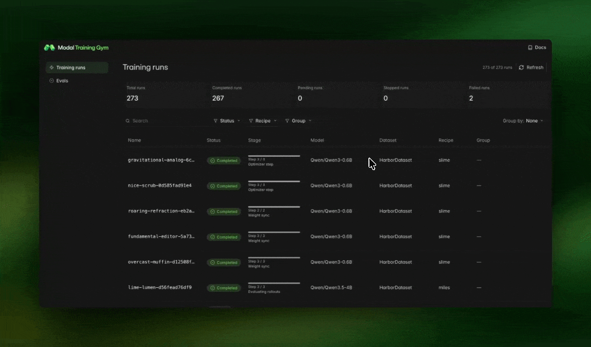
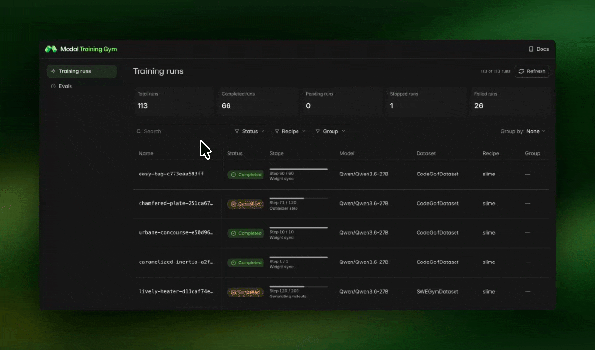

# Training Gym

Modal Training Gym is an open-source Python SDK for RL post-training on [Modal](https://modal.com).

The library takes care of infrastructure concerns such as cluster topology, Ray/NCCL bring-up, volume mounts, checkpointing, and serving for eval and rollouts, so you (or your agent!) can focus on training models.

To get started, you can go through the [Quickstart](#quickstart) section below, or paste the prompt below into your favorite agent:

```txt
Install the `training-gym` library. Then, install the skill bundle into the local project with `training-gym skills install`. Finally, tell the user that they can ask you to do something like: "Given a budget of 1 B300, train Qwen3.8 27B to correctly solve problems taken from agentica-org/DeepCoder-Preview-Dataset with xhigh reasoning and a length penalty to limit the number of reasoning tokens."
```

## Quickstart

Requirements:

- Python 3.12

Install the package directly:

```bash
uv pip install -q git+https://github.com/modal-projects/training-gym.git@main
```

Or pin it in `pyproject.toml`:

```toml
training-gym = { git = "https://github.com/modal-projects/training-gym.git", branch = "main" }
```

Authenticate with Modal:

```bash
modal setup
```

Set up the [dashboard](https://gym.modal.dev/guides/dashboard):

```bash
training-gym setup
```

<div class="tg-dashboard-previews">
  <span>
    
  </span>
  <span>
    
  </span>
</div>

And empower your agents with the Gym's skill bundle:

```bash
training-gym skills install
```

Then, it's as easy as:

```python
from modal_training_gym import (
    HuggingFaceDataset,
    Qwen3_4B,
    Qwen3_4b_Recipe,
    TrainConfig,
)

config = TrainConfig(
    model=Qwen3_4B(),
    dataset=HuggingFaceDataset(
        hf_repo="zhuzilin/dapo-math-17k",
        hf_split="train[:120]",
        input_column="prompt",
        output_column="label",
        apply_chat_template=True,
    ),
    recipe=Qwen3_4b_Recipe(
        gpu_type="H100",
        actor_num_nodes=1,
        actor_num_gpus_per_node=8,
        tensor_model_parallel_size=1,
        sequence_parallel=False,
        rollout_num_gpus=8,
        rollout_num_gpus_per_engine=1,
        colocate=True,
        num_rollout=1,
        n_samples_per_prompt=4,
        rollout_batch_size=8,
        rollout_max_response_len=2048,
        max_tokens_per_gpu=4096,
        sglang_mem_fraction_static=0.6,
        rm_type="deepscaler",
    ),
)
run = config.launch()
print(run.training_run_id)
```

## Supported models

<!-- BEGIN MODELS LIST -->
<!-- Auto-generated by scripts/generate_models_table.py from the recipe registries in modal_training_gym/train_recipes/*/__init__.py. -->

| Family | Models |
|---|---|
| GLM | <ul><li>[GLM-4.7](https://huggingface.co/zai-org/GLM-4.7)</li></ul> |
| Gemma | <ul><li>[gemma-4-26B-A4B-it](https://huggingface.co/google/gemma-4-26B-A4B-it)</li></ul> |
| Inkling | <ul><li>[Inkling-Small](https://huggingface.co/thinkingmachines/Inkling-Small)</li></ul> |
| Moonlight | <ul><li>[Moonlight-16B-A3B-Instruct](https://huggingface.co/moonshotai/Moonlight-16B-A3B-Instruct)</li></ul> |
| Qwen3 | <ul><li>[Qwen3-0.6B](https://huggingface.co/Qwen/Qwen3-0.6B)</li><li>[Qwen3-1.7B](https://huggingface.co/Qwen/Qwen3-1.7B)</li><li>[Qwen3-4B](https://huggingface.co/Qwen/Qwen3-4B)</li><li>[Qwen3-8B](https://huggingface.co/Qwen/Qwen3-8B)</li><li>[Qwen3-ASR-1.7B](https://huggingface.co/Qwen/Qwen3-ASR-1.7B)</li><li>[Qwen3-VL-8B-Instruct](https://huggingface.co/Qwen/Qwen3-VL-8B-Instruct)</li></ul> |
| Qwen3.5 | <ul><li>[Qwen3.5-0.8B](https://huggingface.co/Qwen/Qwen3.5-0.8B)</li><li>[Qwen3.5-2B](https://huggingface.co/Qwen/Qwen3.5-2B)</li><li>[Qwen3.5-4B](https://huggingface.co/Qwen/Qwen3.5-4B)</li><li>[Qwen3.5-9B](https://huggingface.co/Qwen/Qwen3.5-9B)</li></ul> |
| Qwen3.6 | <ul><li>[Qwen3.6-27B](https://huggingface.co/Qwen/Qwen3.6-27B)</li><li>[Qwen3.6-35B-A3B](https://huggingface.co/Qwen/Qwen3.6-35B-A3B)</li></ul> |
| Qwen3.8 | <ul><li>[Qwen3.8-27B](https://huggingface.co/Qwen/Qwen3.8-27B)</li></ul> |
<!-- END MODELS LIST -->

## Multi-node access

> [!IMPORTANT]
> Single-node training is open to everyone. Multi-node clusters are still in Beta and are required for larger models. [Contact us on Slack](https://modal.com/slack) for access.
