# Launch stack: current flow + redesign plan

This doc maps the env/agent-CLI launch stack end to end — what happens when an
operator runs one command — and lays out the redesign that deduplicates the
logic and restructures it into a clean, testable flow. Every node in the
diagram names the file that owns that step (GitHub's mermaid renderer does not
allow embedded links, so the [ownership table](#who-owns-what) below carries
the clickable paths).

## The walked example

```bash
agents/run_sandbox_modal.sh codex_kimi3 fav2
```

Codex CLI driving the Kimi K3 team endpoint, on the `fav2` (SEC EDGAR QA)
task, all defaults: track `easy`, budget 23.5 h, model `auto` (resolved from
the endpoint at launch).

## Current flow

```mermaid
flowchart TD
    CMD(["$ agents/run_sandbox_modal.sh codex_kimi3 fav2"])

    subgraph LAPTOP["Operator laptop"]
        ARGS["1 · fill session config<br/>CLI args → --config YAML → defaults<br/><i>agents/run_sandbox_modal.sh</i><br/><i>agents/lib/session_config.sh (awk)</i>"]
        ENVP["2 · env plumbing<br/>MODAL_ENVIRONMENT, volume name<br/>process env → repo .env<br/><i>agents/run_sandbox_modal.sh (_envget)</i>"]
        SEED["3 · seed the workspace copy<br/><i>workspace_setup/prepare_workspace.sh</i>"]
        PLAN["3a · seeding plan (eval'd shell vars)<br/>archetype qa → harnesses, methods, packages<br/><i>harness/config.py --emit-seed-env</i><br/><i>task_configs/fav2.yaml</i>"]
        STITCH["3b · stitch AGENTS.md concrete<br/>objective/data_access/setup blocks<br/><i>workspace_setup/setup_agent_md.py</i><br/><i>instructions/</i>"]
        ASSETS["3c · task assets in, held-out OUT<br/>corpus + dev.json seeded<br/>test.json deleted always<br/><i>tasks/fav2/</i>"]
        TOOLBOX["3d · compose toolbox<br/>starters by name, cards by method,<br/>pinned packages materialized<br/><i>toolbox_bank/ + clone_repos.py</i>"]
        DOTENV["3e · workspace .env<br/>API keys STRIPPED,<br/>judge/user-sim service URLs kept<br/>+ .learning_agent_sandbox marker"]
        SHIP["4 · upload session + pull base model<br/>cloud-to-cloud, weights skip the laptop<br/><i>agents/run_sandbox_modal.sh (heredocs)</i>"]
        SPAWN["5 · deploy + spawn detached<br/><i>agents/modal_runner.py</i>"]
    end

    subgraph CONTAINER["Modal container (app lab-agent)"]
        RS["6 · run_session<br/>mount volume, 120s committer,<br/>SIGTERM forwarding<br/><i>agents/modal_runner.py</i>"]
        ENTRY["7 · container entry<br/>HOME → logs/home (CLI state persists)<br/><i>agents/lib/container_entry.sh</i>"]
        WATCH["observatory watcher<br/>from read-only /seed (tamper-proof)<br/><i>observatory/cli</i>"]
    end

    subgraph WS["Agent workspace (the submission)"]
        RUN["8 · inner run primitive<br/>sandbox-marker check, model default case,<br/>preemption resume via run_state.env<br/><i>agents/run.sh</i>"]
        PROMPT["8a · prompt = preamble + AGENTS.md<br/><i>agents/lib/make_prompt.py</i>"]
        TIMER["8b · timer.sh + watchdog<br/>grace kill at budget+5min<br/><i>agents/lib/make_timer.sh</i>"]
        SOLVE["9 · scaffold launch<br/>unset provider keys, resolve model<br/>from /v1/models ('auto' sentinel)<br/><i>agents/codex_kimi3/solve.sh</i>"]
        SHIM["9a · Responses→Chat shim<br/>codex is Responses-only;<br/>endpoint serves chat<br/><i>agents/lib/responses_shim.py</i><br/><i>agents/lib/kimi_k3_endpoint.env</i>"]
        AGENT["10 · the agent session (hours)<br/>study corpus → generate data →<br/>train (bench.py) → dev-eval → wire<br/>submission/eval.py, log experiments"]
        LOOPS["11 · liveness loops<br/>re-prompt while ≥30 min left;<br/>codex resume --last after preemption<br/><i>agents/codex_kimi3/solve.sh</i>"]
        POST["12 · post-run<br/>trace → human-readable, contamination<br/>audit, LEARNING_LOG diff, summary<br/><i>agents/lib/audit_trace.py</i><br/><i>agents/codex_kimi3/human_readable_trace.py</i>"]
    end

    OUT[("artifacts<br/>volume: fav2/&lt;session&gt;/{workspace,logs}<br/>workspace = the scored submission")]
    SCORE(["operator scores later:<br/>python submission/eval.py + rubric judge<br/>→ runs/LEADERBOARD.jsonl"])

    CMD --> ARGS --> ENVP --> SEED
    SEED --> PLAN --> STITCH --> ASSETS --> TOOLBOX --> DOTENV
    DOTENV --> SHIP --> SPAWN --> RS --> ENTRY
    ENTRY --> WATCH
    ENTRY --> RUN
    RUN --> PROMPT --> TIMER --> SOLVE
    SOLVE --> SHIM --> AGENT --> LOOPS --> POST
    POST --> OUT --> SCORE
    WATCH -.->|ingest every 60s| OUT
```



### Who owns what

| Step | Owner | Role |
|---|---|---|
| 1–2, 4–5 | [agents/run_sandbox_modal.sh](../agents/run_sandbox_modal.sh) ([agents/run_sandbox_docker.sh](../agents/run_sandbox_docker.sh) is its twin) | operator CLI: args, env, ship, spawn |
| 1 | [agents/lib/session_config.sh](../agents/lib/session_config.sh) | awk YAML readers for `task:`/`session:` |
| 3 | [workspace_setup/prepare_workspace.sh](../workspace_setup/prepare_workspace.sh) | THE shared seeding routine |
| 3a | [harness/config.py](../harness/config.py) + [task_configs/fav2.yaml](../task_configs/fav2.yaml) | config resolution; `--emit-seed-env` bridge |
| 3b | [workspace_setup/setup_agent_md.py](../workspace_setup/setup_agent_md.py) + [instructions/](../instructions/) | AGENTS.md stitching |
| 3d | [toolbox_bank/](../toolbox_bank/) | tool bank the workspace toolbox is composed from |
| 5–6 | [agents/modal_runner.py](../agents/modal_runner.py) | Modal app; container side |
| 7 | [agents/lib/container_entry.sh](../agents/lib/container_entry.sh) | shared container entry (Modal + Docker) |
| 8 | [agents/run.sh](../agents/run.sh) | inner run primitive |
| 8a–8b | [agents/lib/make_prompt.py](../agents/lib/make_prompt.py), [agents/lib/make_timer.sh](../agents/lib/make_timer.sh) | prompt assembly, wall-clock enforcement |
| 9, 11 | [agents/codex_kimi3/solve.sh](../agents/codex_kimi3/solve.sh) | scaffold: CLI wiring, resume, re-prompt |
| 9a | [agents/lib/responses_shim.py](../agents/lib/responses_shim.py), [agents/lib/kimi_k3_endpoint.env](../agents/lib/kimi_k3_endpoint.env) | Responses→Chat bridge; pinned endpoint |
| 12 | [agents/lib/audit_trace.py](../agents/lib/audit_trace.py) | deterministic contamination audit |

## What's duplicated / tangled today

1. **Config resolution exists three times.** Properly in Python
   (`harness/config.py: resolve/deep_merge`), and twice as awk scrapers —
   `session_config.sh` is sourced with its own precedence code in BOTH
   `run_sandbox_*.sh` AND `run.sh`, each with its own `_envget` `.env` reader
   (whose missing-`|| :` failure mode already bit once).
2. **The Python→bash bridge is `eval` of 14 printed env vars**
   (`--emit-seed-env`). Every new toolbox knob touches `config.py`,
   `prepare_workspace.sh`, and often both runners.
3. **22 scaffold dirs that are ~90% identical.** The codex family alone has 8
   variants differing only in flags/effort/re-prompt. Default-model knowledge
   for all of them lives in a SEPARATE hardcoded `case` in `run.sh` — two
   places to update per scaffold.
4. **`run.sh` mixes five concerns**: config, resume/state, prompt assembly,
   process supervision, post-run audit/report.
5. **The two runners have drifted**: default hours 24 vs 23.5, and comments
   still reference `agents/run_sandbox.sh`, which no longer exists.
6. **Inline heredoc Python** (model download, spawn, repos.yaml filter)
   scattered through the shell.

## Redesign plan

Goal: one entry point, config resolved once, scaffolds declarative,
backends thin — while keeping the seeded surface (`agents/run.sh`,
`agents/lib/`, `agents/<scaffold>/` paths inside a workspace) stable so
manifests, the audit, and the observatory keep working unchanged.

### Phase 1 — one config resolver (pure dedupe, no behavior change)

- Add `SessionSpec` resolution to `harness/config.py`: CLI > `--config` >
  `task_configs/<T>.yaml session:` > per-scaffold defaults. One function, one
  precedence order, snapshotted into `run_meta.json`.
- Move scaffold default models out of `run.sh`'s `case` into a
  `default_model:` field per scaffold (see Phase 3), read by the resolver.
- Delete `session_config.sh` and both `_envget` copies; the runners call
  `python3 harness/config.py --resolve-session ...` and consume one JSON/env
  blob. `.env` reading goes through `harness/envfile.py` (already exists).
- Acceptance: both runners produce byte-identical `run_meta.json` for the
  same inputs; `tests/test_config.py` grows session-resolution cases.

### Phase 2 — seeding in Python (kill the eval seam)

- Port `prepare_workspace.sh` to `workspace_setup/seed.py`, consuming
  `toolbox_config()` directly — the `LEARNING_AGENT_TB_*` env bridge and the
  three embedded heredoc scripts disappear. `git archive` stays as subprocess
  calls; manifest/pruning logic becomes unit-testable.
- Acceptance: seeded workspace tree is identical (manifest diff empty) for
  every registered task × track before/after.

### Phase 3 — declarative scaffolds

- One `scaffold.yaml` per variant (`cli: codex`, `default_model:`,
  `env_unset:`, `flags:`, `effort:`, `reprompt: {min_remaining: 1800}`,
  `endpoint: kimi_k3`, `shim: responses`) rendered by ONE generic launcher
  (`agents/lib/solve_runner.py`) plus one trace parser per CLI family
  (claude, codex, gemini, opencode — 4–5 parsers instead of 22 copies).
- `agents/<scaffold>/solve.sh` becomes a 2-line shim invoking the generic
  launcher, so workspace-relative paths and the seed manifest stay valid.
- Migrate family by family (codex first — most variants), A/B smoke each one
  against the current script before deleting it.

### Phase 4 — split the inner primitive

- `run.sh` becomes a thin orchestrator over three modules in `agents/lib/`:
  `prompt` (exists: make_prompt), `supervise.py` (timer, process-group
  watchdog, `run_state.env` resume), `report.py` (trace parse, audit, log
  diff, summary). Bash keeps only what must be bash (process-group
  semantics), everything else is imported Python.

### Phase 5 — thin backends

- `LocalBackend` / `DockerBackend` / `ModalBackend` classes implementing
  `stage() / launch() / logs_hint()`; `run_sandbox_modal.sh` and
  `run_sandbox_docker.sh` become thin wrappers (or a single `lab agent run
  --backend ...` CLI) over them. The Modal heredocs become named functions in
  `modal_runner.py`. Backend-specific facts (23.75 h clamp) live in the
  backend, visibly.
- Fix the doc drift (`run_sandbox.sh` references) as part of this phase.

### Open decisions (blocking, want input on this PR)

1. **Pins/freeze**: `bench/pins.json` hash-pins files and freezes happen only
   on the canonical machine. Does this land as a new generation (one refreeze
   per phase?) or must Phases 1–2 stay pin-compatible?
2. **Seeded-surface stability**: the plan keeps `agents/run.sh` +
   `agents/lib` + `agents/<scaffold>/solve.sh` paths so existing manifests /
   audits / observatory globs survive. If we're willing to redesign the
   workspace layout too, Phase 3's shims can go away entirely — but every
   downstream consumer of the manifest needs a pass.
3. **Rollout ordering**: phases are ordered lowest-risk-first and each is
   independently landable; fine to stop after any phase.
